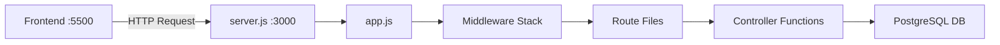
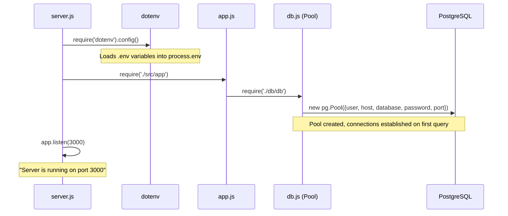
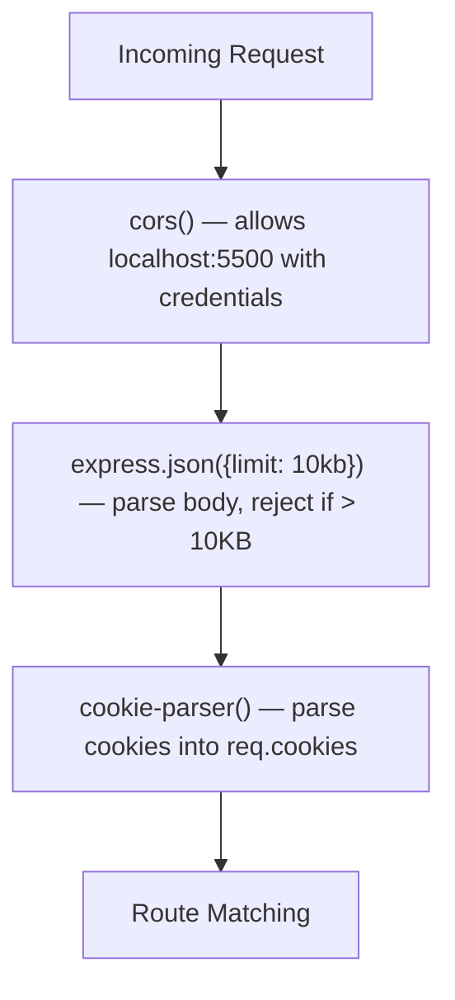
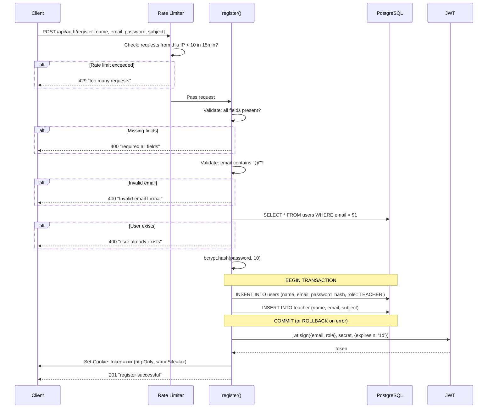
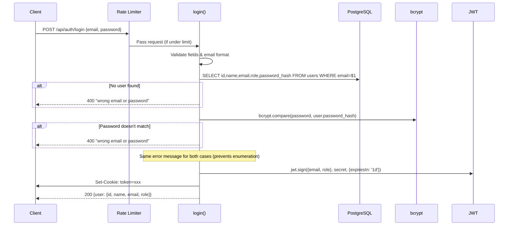
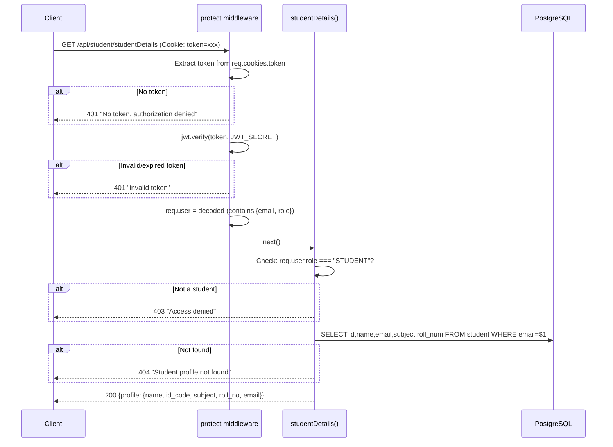
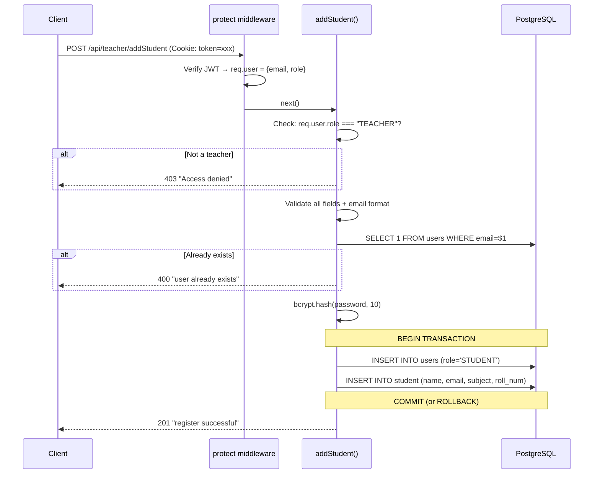
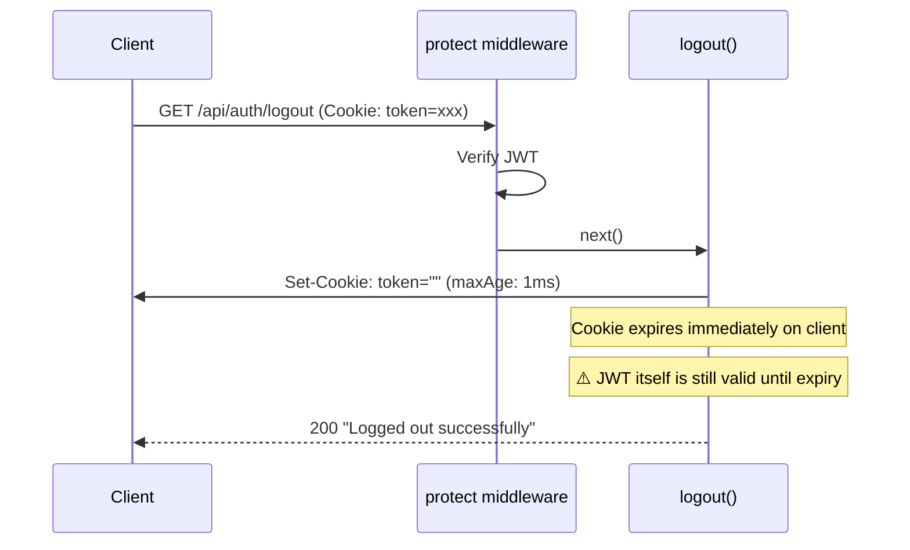
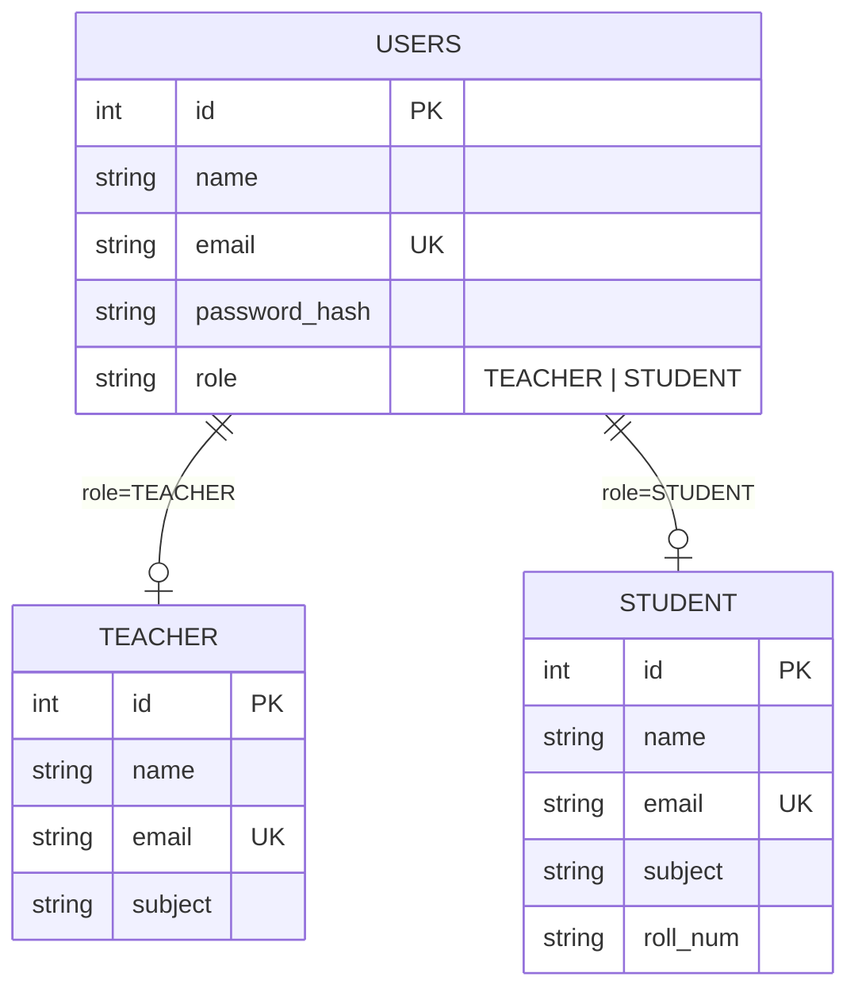
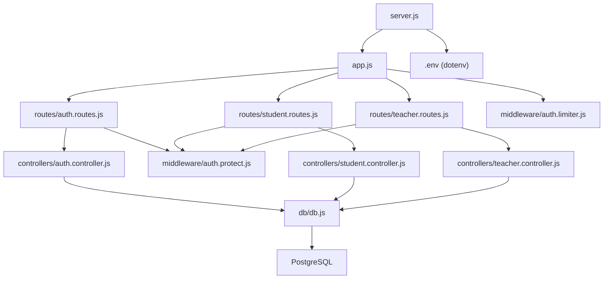

# Backend Code Flow — Student Management System

## Architecture Overview

---

## Server Startup Flow

---

## Middleware Stack (runs on every request)

Every incoming request passes through these layers **in order** before reaching any route:

---

## Route Map

| Method | Full URL | Middleware | Controller | Purpose |
|--------|----------|-----------|------------|---------|
| `POST` | `/api/auth/register` | `limiter` | `auth.register` | Register teacher |
| `POST` | `/api/auth/login` | `limiter` | `auth.login` | Login user |
| `GET` | `/api/auth/me` | `limiter` → `protect` | `auth.me` | Get current user |
| `GET` | `/api/auth/logout` | `limiter` → `protect` | `auth.logout` | Logout user |
| `GET` | `/api/student/studentDetails` | `protect` | `student.studentDetails` | Get student profile |
| `GET` | `/api/teacher/teacherDetails` | `protect` | `teacher.teacherDetails` | Get teacher profile |
| `POST` | `/api/teacher/addStudent` | `protect` | `teacher.addStudent` | Add a student |

---

## Flow 1: Teacher Registration (`POST /api/auth/register`)

---

## Flow 2: Login (`POST /api/auth/login`)

---

## Flow 3: Protected Route Access (e.g. `GET /api/student/studentDetails`)

---

## Flow 4: Add Student (`POST /api/teacher/addStudent`)

---

## Flow 5: Logout (`GET /api/auth/logout`)

---

## Database Schema (implied from queries)

---

## File Dependency Graph

